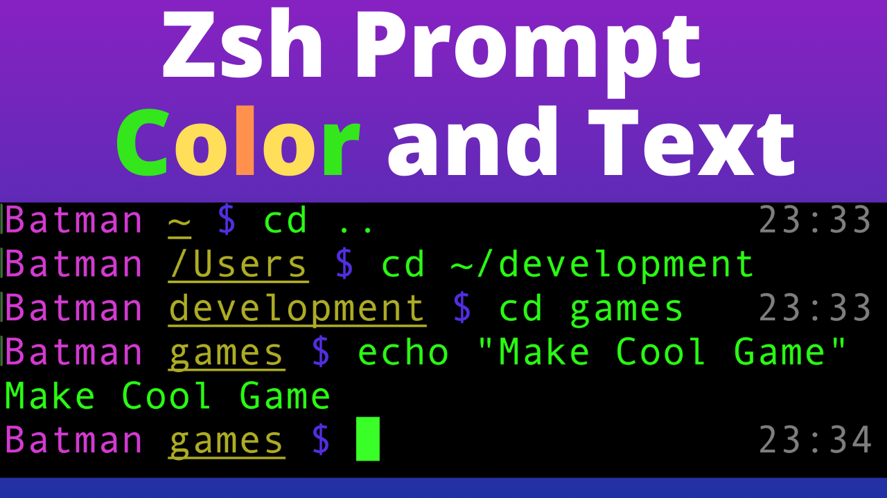

# How to Customize Zsh Command Prompt Text

YouTube Link: https://youtu.be/i7FzA4NavDs

In this video you will learn how to customize the Z Shell(Zsh) command prompt text.

We will understand how the text is formatted using special characters. We will add color to the command prompt. This will include colors using words and 3 digit codes. We will explore what PS1 and Prompt environment variables are. Additionally we will add prompt text to the right side of the screen using RPrompt Lastly we will hide the "last login text" when you open a new command prompt using a special file called .hushlogin

All the changes we do here will be reflected for VSCode if zsh is your default command prompt in VSCode.

Indirectly from this fun tutorial you will learn the following commands / concepts

- cd - change directory
- ls - list directories
- touch - make a file if does not exist
- rm - remove file
- pwd - current location
- environment variables
- reload zshrc file

### This is the default command prompt format:

PS1="%n@%m %1~ %# "

### The final Prompt and RPrompt values:

PROMPT="%F{magenta}Adam%f %U%F{yellow}%1~%f%u %F{blue}$%f "
RPROMPT="%F{241}%T%f"
